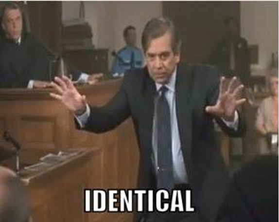

# From Agile Athletes to Agile Product Management by Adam Burstyn

Does this sound like a job posting for your current role?:
-	Cross-Functional Collaboration
-	Product Planning and Strategy
-	Performance Monitoring and Analysis
-	Develop a Product Vision
-	Knowledge of Agile Principles

Then you might be a product manager. Or…you could be a strength and conditioning coach.

With a career in strength and conditioning I developed many skill sets, none of which were driving a software product vision to frution. After deciding to end my strength and conditioning career and pivot into the tech sector, I landed a position as data scientist at a startup company. Not long after starting my role, I noticed some areas in the company that had areas that could be improved upon by implementing new software products into the workstreams. I immediately took on the role of implementing my products to aid these areas and improve key performance metrics. The products I spearheaded made a profound impact on the business and changed the way the associated departments operated.

The question is, how is one able to lead product development initiatives with a background in athletic coaching? The answer is very simple: There is a major overlap in the skillsets and processes between leading the development of a tech product and running a strength and conditioning program. Without knowing it at the time, I had been leading agile projects for my entire career as a strength coach.

While the following article is not an exhaustive list of the parallels between the two positions, I will highlight how functionally a product manager driving software development and running a strength and conditioning program are quite similar.

 

<b>Cross-Functional Collaboration</b>

A product manager needs to effectively communicate across multiple departments within an organization in order to be successful. These interactions may include, gathering product requirements from stakeholders, translating requirements into actionable items for development teams, and obtaining feedback from customers.

Likewise, a strength coach will need to collaborate across multiple departments in order to run a successful program. The main stakeholder is the head sport coach. They will need to be onboard with the vision of your program. While each sport and position have general needs requirements that can be used to generate a strength and conditioning plan, the sport coach will also have requirements that will shape your product (your product as a strength coach being your strength and conditioning program). While a business may have certain platform or regional requirements, a head coach's game strategy will dictate the way you need to structure your training program. For example, a football coach who’s offensive strategy is to run a no-huddle, fast paced, high tempo offense will require offensive linemen with different attributes than a power run game.

Another stakeholder department that a strength coach will be in frequent communication with is the medical/athletic training staff. As athletes inevitably get banged-up or injured throughout their career, there will be limitations/modifications needed to keep them progressing to keep them on track to perform in their sport at the maximal level while not interfering with the medical treatment of the injury. Training modifications will need to be in line with specifications from the medical staff.

<b>Leading Without Authority</b>

A major component of product management is leading and motivating teams that they do not have direct authority over. This can include engineering, marketing, sales, or design teams. While each of those componenets must work in unison and in-line with the product's vision, they generally have their own management that individual contributors report to.

A very similar situation arises in strength and conditioning. As a strength coach, you are not the athetles head sport or position coach. The head sport or position coaches are the ones who the athletes directly report to as they dictate the athletes playing time, game strategy, and position depth charts. Although you do not have a direct say in an athletes playing time, it is essential as a strength coach to have full buy-in, respect, and engagement from all the athletes in order to have a successful and effective program.

<b>Agile Product Development</b>

While there are many different frameworks/methodologies used in software product development (and teams will inevitably blend together various components from different formats to suit their needs), one of the more popular methods is some form of agile development methodology using the scrum framework. While this article is not intended to be a complete overview of the scrum framework or provide formal definitions of the referenced items, I will highlight some of the high-level concepts.

At a very high-level, the agile-scrum process can be broken down into events and artifacts. The artifacts are the product backlog, the sprint backlog, and the product increment. The events are sprint planning, the daily scrum, the sprint review, and the sprint retrospective.

The product backlog is the collection of action items that need to be implemented in order to improve the product. This is no different than an athlete’s needs analysis based on their sport/position. A very basic wide receiver’s “backlog” may resemble something like: Proper muscle balance/movements mechanics to mitigate the risk of injury, muscle size/strength to protect joints and overpower opponents, and power production/running speed to outrun opponents. The product backlog can change at any time (hence the term agile development) due to changes in customer markets, organization vision, or a number of other factors. Likewise a strength coaches training plan for an athlete can be altered at time by things such as, sport coaches adjusting practice schedules, player injury, and a number of other unforeseen circumstances (a few scenarios I have personally encountered are hurricanes and power outages in the building forcing alterations to the planned schedule).

In software development, a period of work is often called a sprint. This is usually a 2-4 week cycle of work in order to complete tasks needed to improve the product. Each sprint is preceded by a sprint planning meeting where the goals of the sprint are discussed, and the action items are compiled for the development team to implement. The result of the sprint planning meeting is the creation of the sprint backlog. The sprint backlog is simply the subset of work that is taken from the product backlog that will be implemented during the upcoming sprint. The items for the sprint backlog are chosen based on the priority/impact they will have on the product and the volume of work the development team can handle during the allotted time frame (known as velocity). Overloading a developer for an extended period of time can lead to under performance, burnout, and possibly health related consequences.

While they are generally referred to as training phases or cycles, the strength and conditioning planning and implementation process mirrors a sprint. A phase of training may be broken up into different cycles or blocks. At the beginning of each block, the strength coach will meet with the sport coaches and medical staff to determine what particular attributes should be prioritized for the group as a whole, as well as at the individual athlete level. The pre-phase meeting will then turn into the program for that given period of time, which is equivalent to the sprint backlog. While a block of training can look to work on multiple athletic attributes, there is generally a prioritized focus given to a specific attribute. For example, as the competitive season approaches, it is ideal for a running back to be focusing their training for on-field speed. In contrast, an athlete coming off of an injury may have a phase of training (or sprint) focused on regaining range of motion or stability in a specified joint.

A key component to the pre-training plan meeting is discussing all the activities such as training, practice, competition, and potentially physical therapy the athlete will be participating in. No different than a developer’s velocity, an athlete has a certain workload, or volume they can safely handle during a given period of time period. Chronic periods of excessive volume in an athlete’s workload can contribute to decreases in performance, burnout, and potentially injury.

During a sprint, a scrum team will have a brief, daily meeting known as the daily scrum where they discuss their progress on the sprint goals and any blockers they may have that are preventing them from making progress. A common practice in strength and conditioning is to very briefly address the team prior to the workout to cover the days planned training activities. I always kept an open communication policy for athletes to discuss any concerns they had with the days plan such as a new pain or discomfort they are experiencing. This is essentially a blocker to the pre-planned activity which will need to be overcome. A strategy to overcome a blocker of this fashion can be to modify an exercise (modifications given around injuries are always done in line with guidance and consultation of the medical staff) such as using a neutral grip dumbbell press as a substitute for a straight bar bench press if holding the fixed straight bar position causes discomfort to the athlete’s wrist.

After the completion of a sprint, a scrum team will hold a sprint review meeting where they will look at the new working version of the product. This meeting allows for the team to discuss what features to work on during the next sprint and update the product backlog accordingly. The new version of the working product will also need to be measured to determine if the newly implemented features are successful. An example of this can be an increase in user purchases for a service after implementing a change to the purchase process. Likewise, an athlete will have quantifiable improvements in the targeted attribute after a successful phase of training, for example, an increase in their maximum squat weight after a strength phase. Strength and sport coaches will also meet after the completion of training cycles to review the tested measurables and discuss future team and individual athlete improvement plans.

Another meeting a scrum team will have at the conclusion of a sprint is a sprint retrospective, where they will discuss improvements to things such as the processes, tools, and collaboration methods they used during the previous sprint. The goal here is to improve the way the team works. A strength and conditioning program will have a similar meeting with sport coaches at the end of a training cycle where they will discuss areas for improvement. These areas can cover things such as incorporating different types of team-based challenges during training sessions or restructuring of workout groups and times in an effort to improve the team as a whole.

While they may seem like two completely unrelated fields, strength and conditioning and software product management are actually strikingly similar. While my personal experiences drew me to notice the similarity between developing agile athletes and agile software product managers, I doubt there are not several other seemingly unrelated fields that overlap with product management. If you are looking for someone to drive your companies next product, you might be looking for a product manager…but it might actually be a strength coach that you need!
